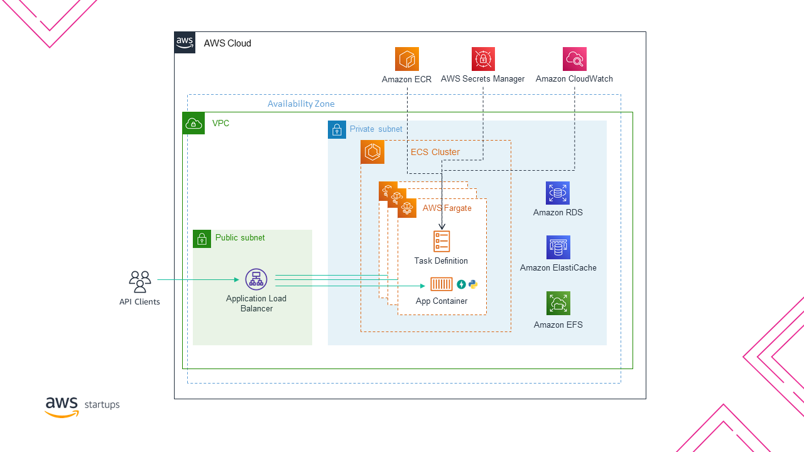

# Deploy a Fargate API with AWS Copilot

_Presented as part of the Coffee & Cloud Series_

Let's connect: https://linktr.ee/fortejas

## Objective

In this lab we'll deploy [FastAPI](https://fastapi.tiangolo.com/) to AWS Fargate. FastAPI is a Python framework that makes it easy to build APIs that are quick in a short amount of time. We'll use AWS Fargate because it's a

## Requirements

- Git Installed
- Python 3 Installed
- Docker Installed
- AWS Account
- AWS CLI Installed and [Configured](https://docs.aws.amazon.com/cli/latest/userguide/cli-configure-quickstart.html)
- CoPilot [Installed](https://aws.github.io/copilot-cli/docs/getting-started/install/) (we use v1.12.0 here)

## Expected Time

You should be able to deploy this in about 60mins.

## Architecture Overview

Here is the architecture that we'll be building using AWS Copilot CLI. The only parts that are not configured here are the RDS, ElasticCache & EFS which are here to demonstrate where you would deploy these services in order to access them securely from your container deployed on Fargate.



### What is the difference between Amazon ECS and AWS Fargate?

It's important to note the difference between the two. ECS is considered part of the scheduler and control how containers are deployed and distributed. AWS Fargate is considered to be the "runtime" where the container is provisioned. I.e. you can have both EC2 or Fargate runtimes that are deployed by ECS.

## Getting Started

### Creating the API

The code for the API has been provided in this repo. You can clone the repo to your local machine, install the python requirments in `requirements.txt` and then test that the server works.

_Note: It's best practice to make use of a virtual environment for your python dependencies so that you don't override system wide installed packages._

```bash
$ uvicorn server:app
```

You should be able to navigate to [http://localhost:8000](https://localhost:8000) to see the hello world response. Or you can use a command line tool like [curl](https://github.com/curl/curl) or [Httpie](https://github.com/httpie/httpie).

```bash
$ http 127.0.0.1:8000
HTTP/1.1 200 OK
content-length: 17
content-type: application/json
date: Thu, 25 Nov 2021 10:57:20 GMT
server: uvicorn

{
    "hello": "world"
}
```

#### `Dockerfile`

Notice that we're basing off a 3.9.9 base image and we're doing all of the necessary steps to build the container image. It's important to specify the port that we'll exposed so that Copilot can identify which port to configure when deploying to AWS.

```dockerfile
EXPOSE 5000
```

#### `start_server.sh`

We've configured the container to boot up indirectly using a script rather than a CMD command. This can be useful because it allows you to do operations such as pulling config files, loading secrets or variables or checking dependencies before you start the actual API.

#### `.dockerignore`

This is a somewhat under-used feature of Docker specifically. It actually tells Docker to ignore files when doing operations such as the `COPY` command - it therefore leads to smaller image sizes which improve the performance of your deployments. This is especially important if you prefer to keep your environment folder for python within the same directory as your code.

### Deploying to a test environment with Copilot

In order to deploy our code we need to create an application and a service. An application is a logical grouping of a number of services and components that would contribute towards a functional domain within a business. An application could consist of load balanced web services, backend services hosted in private subnets, worker services that consume asynchronously off a queue and cron based, scheduled tasks.

We'll launch our app `fun-app` and name our service `api`.

```
$ copilot init
```

You'll be prompted for some information:

- **Application name:** fun-app
- **Workload type:** Load Balanced Web Service
- **Service name:** api
- **Dockerfile:** ./Dockerfile
- **Deploy a test environment:** yes

Copilot will start provisioning resources into your account. This includes things like an ECR Repo, VPCs and Subnets as well as the ECS Cluster. It will also build and push your image to ECR and do an initial deployment. The CLI prompts should show you the progress of the deployment.

Once deployed and complete the CLI will output the URL of the endpoint where you can access the API.

Alternatively, to get information about the service using the Copilot CLI you can do the following:

```bash
$ copilot svc show api
```

You can visit the URL in your browser to see the API responds. You could also use a CLI tool to check.

```bash
$ http http://fun-a-Publi-1OJYQ16ELNCX9-264333988.eu-west-3.elb.amazonaws.com
HTTP/1.1 200 OK
Connection: keep-alive
Content-Length: 17
Content-Type: application/json
Date: Thu, 25 Nov 2021 13:55:41 GMT
server: uvicorn

{
    "hello": "world"
}
```
